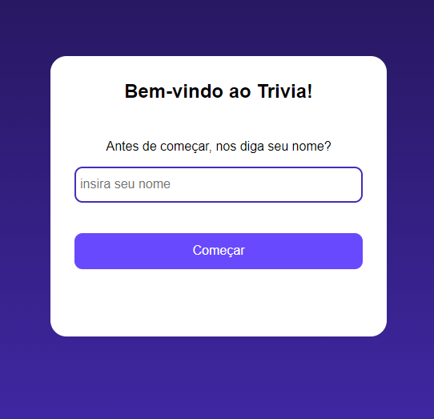

# Projeto Trivia 
>Laboratória Pré-admissão SAP-010  
>Criado por: Helouise Itokazo e Nicole Tsingas

 Projeto criado para a Pré-admissão da Laboratoria, onde foi solicitado criar um mini game Trivia. (trivia é um jogo onde voce responde perguntas para testar seus conhecimentos).

 
 

<h1>Como Funciona</h1>

O jogador deverá inserir um nome válido (não aceita números, caracteres especiais ou vazio). Em seguida deve clicar no botão <strong>Começar</strong> para poder escolher o tema (Cachorros ou Gatos). Após escolher o tema, será mostrado três perguntas na qual cada uma tem somente uma alternativa correta. Será pontuado 10 pontos cada acerto e -10 pontos cada erro, sendo assim o jogador pode ficar com saldo negativo. A cada reposta será exibido um alert mostrando sua alternativa escolhida e a alternativa correta da questão.
No final será computado seus pontos e mostrado um resultado, com sua pontuação final e quantas perguntas acertou.

### 📎[Acesse aqui](https://nicoletsingas.github.io/Trivia-Nic-Helo/)

 
 

## 🛠 Tecnologias 

- HTML

- CSS

- Java Script

- Github

- Replit

- Figma

 
 

## ✨Contato

nick_monalisa@outlook.com  
helouise.almeida93@gmail.com
